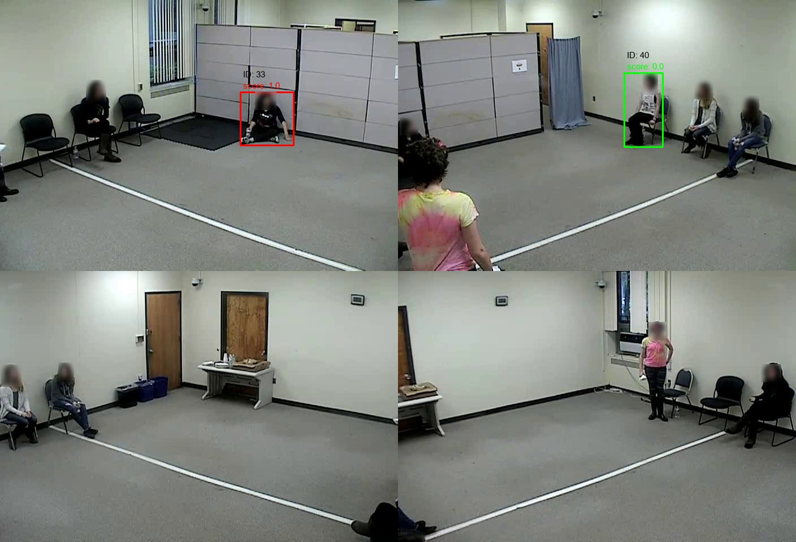
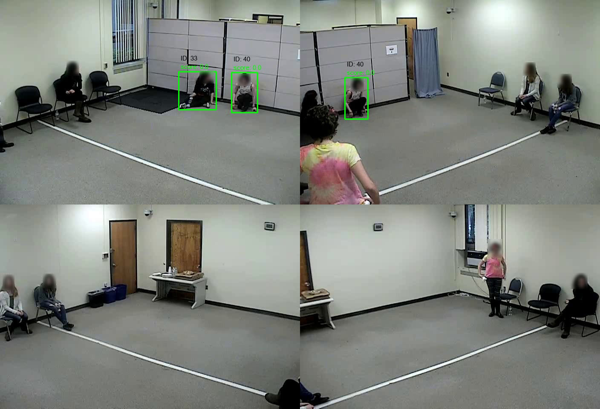



Multi-person Multi-view Close Proximity Estimation
---------------------------------------------------
This project analyzes close proximity from videos captured from different views when multiple children engaging in group activities. We started from keypoints matching and calculating the fundamental matrix between views. 2D pose information was extracted using YOLO v4 and AlphaPose. Then we performed cross-view matching for the same person using the appearance features and geometry correlations between the keypoints, including epipolar and homography. A state-of-the-art person re-identification model was fine-tuned on this data to track the same person across the time frame. After extracting the keypoints and bounding boxes for all target persons, we built and trained a Siamese Multi Layer Perceptron (MLP) to regress the close proximity scores for each person in each minute. The model is able to regress reasonable close proximity estimations even given very unbalanced and noisy labels.  

  
   

Multi-person Multi-view Close Proximity Estimation
---------------------------------------------------

<!-- 

  
 
-->
