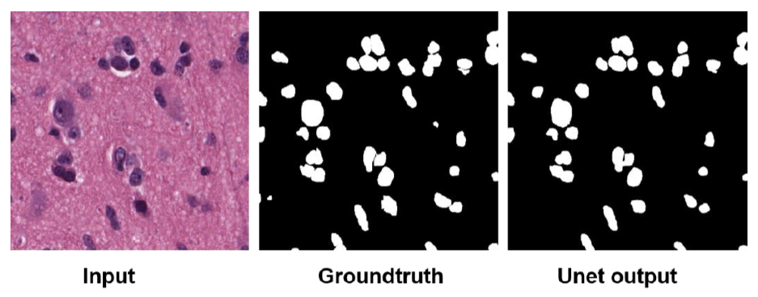



Multi-person Multi-view Close Proximity Estimation
---------------------------------------------------
This project analyzes close proximity from videos captured from different views when multiple children engaging in group activities. We calculated the fundamental matrix between views, extracted 2D pose information using YOLO v4 and AlphaPose. Then we performed cross-view matching for the same person using the appearance features and geometry correlations between the keypoints, including epipolar and homography. A state-of-the-art person re-identification model was fine-tuned on this data to track the same person across the time frame. After extracting the keypoints and bounding boxes for all target persons, we built and trained a Siamese Multi Layer Perceptron (MLP) to regress the close proximity scores for each person in each minute. The model is able to regress reasonable close proximity estimations even given very unbalanced and noisy labels.  

  
   

 

Semi-supervised Action Localization
---------------------------------------------------
We combined [Sequence-to-Segments Network](https://ieeexplore.ieee.org/stamp/stamp.jsp?arnumber=8827968) (S2N), an RNN-based Encoder-Decoder model for detecting segments of interest, with the [Mean Teacher](https://arxiv.org/pdf/1703.01780.pdf) Method, an influential method for semi-supervised image recognition, to the task of action localization. The model is trained with the supervised loss from S2N and the consistency loss from mean teacher. The model shows improvement in average recall and IOU compared to the S2N training with partial labels, and is able to achieve performance close to fully supervised S2N with just 80% of labels. 
 

  

 

Nuclei Segmentation with Very Few Images
---------------------------------------------------
Based on only 32 images in the original training set, we performed various data augmentation techniques, including flipping, rotation, cropping, changing intensity, blurring, and cropped image patches from the augmented images for training UNet. The trained model shows good performance on the testing images in nuclei segmentation.

  

 

Role of Signature Objects in Human Scene Categorization
-----------------------------------------------------------
This study investigated the human brain neural mechanisms in scene categorization, especially when the "signature objects" were masked. We collected functional magnetic resonance imaging (fMRI) data of subjects doing a scene categorization task when signature objects were visible or masked, and conducted statistical analyses to investigate the changes in neural activations, functional connectivities, and activation patterns. The results reveal the role of object and scene-selective regions, especially the top-down modulation effect from the fronto-parietal regions in object-based scene categorization.

  

<!-- 

  
 
-->
